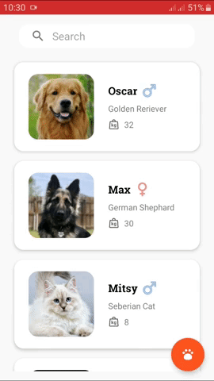

Pets App
===================================

A pet shelter app created with MVVM architecture and search functionality.
 
I took the Pets app, developed by the Udacity team for their introductory course Android Basic: Data Storage, and refactored the code with the latest APIs provided by Android.

     

 

<h2>Follow or Contact:</h2>
 
